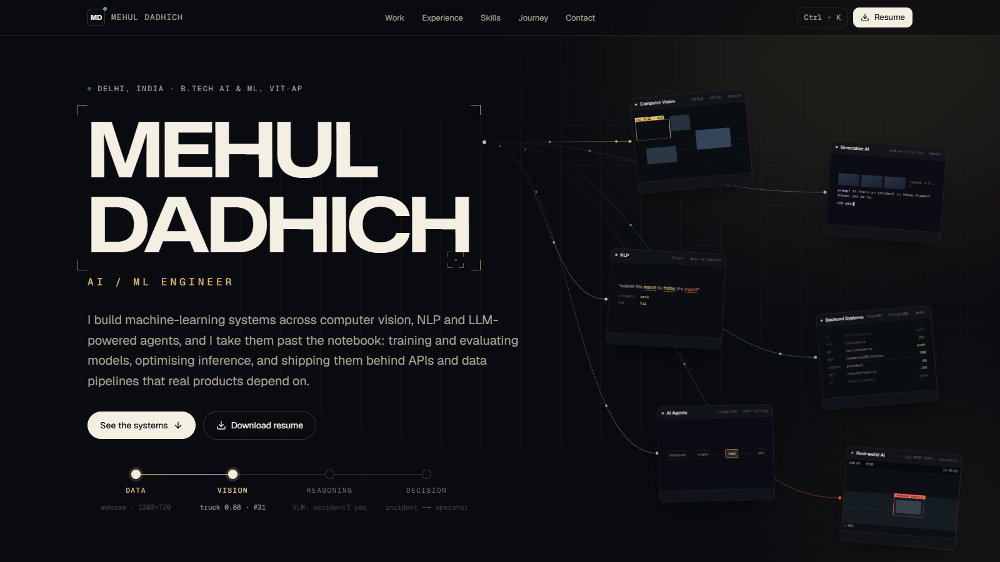
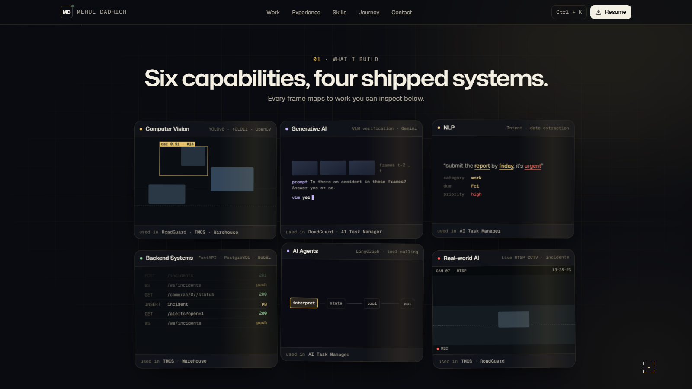
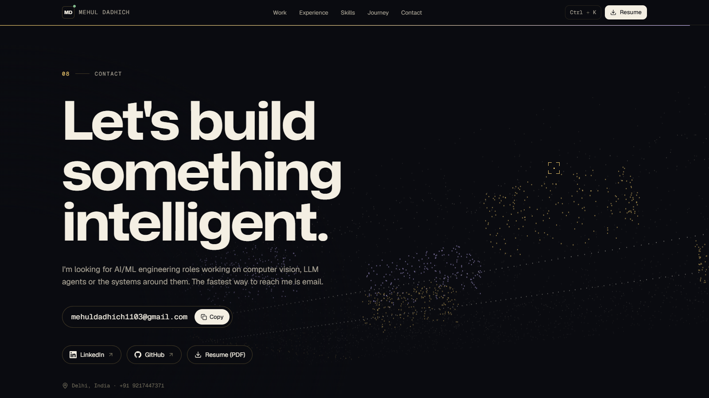
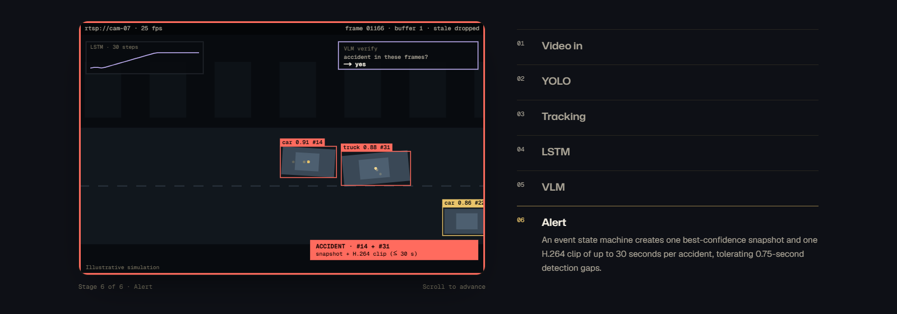

<div align="center">

# Mehul Dadhich · AI/ML Engineer

**A portfolio that behaves like the systems it describes.**

My name is generated by a diffusion sampler, projects are shown as working pipelines,
and the contact page is a live LiDAR scan.

[Live site](https://mehul-portfolio-inky.vercel.app) · [Resume](public/Mehul-Dadhich-Resume.pdf) · [LinkedIn](https://linkedin.com/in/mehul-dadhich-959b7024b) · [GitHub](https://github.com/MehulDadhich)



</div>

---

## What's inside

| | |
|---|---|
| **Diffusion hero** | On load, thousands of particles are denoised over 50 sampler steps into my name, then hand over to real, selectable text. Hover the name and the particles come back and scatter away from the cursor. |
| **Motion frames** | Six capability frames (Computer Vision, Generative AI, NLP, Backend, AI Agents, Real-world AI) fly in from depth, tilt in 3D with the cursor and stream data into the name. On scroll they gather into a fanned deck and burst into a grid. |
| **Scroll-driven case study** | RoadGuard, my accident-detection pipeline, is pinned while you scroll through *Video → YOLO → Tracking → LSTM → VLM → Alert*. An illustrative simulation adds boxes, track IDs, the LSTM score, the VLM verdict and the alert at each stage. |
| **Projects as architectures** | Filterable project cards whose pipelines light up on hover, with an *Explore architecture* view for each system. |
| **Evidence-linked skills** | Pick a project to see which skills it used, or hover a skill to see where it came from. |
| **Arc, the on-site assistant** | A chat assistant built from scratch that runs entirely in the browser, with no external AI API. An intent router plus BM25 retrieval (synonyms, typo tolerance, follow-up memory) answers from a knowledge base generated from the site's own content, and shows its trace. Open it with <kbd>Ctrl</kbd>+<kbd>K</kbd>. Code in `src/lib/assistant/`. |
| **LiDAR contact section** | A street rendered as a 3D point cloud with a sweeping scan ring. The cursor orbits the camera. |
| **Small details** | A detection-box cursor that labels whatever you point at, count-up metrics, scroll-velocity tickers and a footer signature that fills with gold as you reach the end. |

<p align="center">
  
  
</p>
<p align="center">
  
</p>

> **Easter egg:** type <kbd>y</kbd> <kbd>o</kbd> <kbd>l</kbd> <kbd>o</kbd> anywhere on the page.

## Tech stack

| Area | Tools |
|---|---|
| Framework | [Next.js 16](https://nextjs.org) (App Router), React 19, TypeScript |
| Styling | Tailwind CSS v4, design tokens in CSS variables, [shadcn/ui](https://ui.shadcn.com) (dialog) |
| Motion | [Motion](https://motion.dev) for UI and layout animation, [GSAP](https://gsap.com) with ScrollTrigger, SplitText and ScrambleText for scroll and text effects, [Lenis](https://lenis.darkroom.engineering) for smooth scrolling |
| Graphics | Hand-written Canvas 2D: diffusion particles, pipeline simulation, LiDAR point cloud. No WebGL, no 3D library. |
| Fonts | Mona Sans (display), Geist and Geist Mono via `next/font` |
| Icons | lucide-react |

## Getting started

Requires **Node.js 20+**.

```bash
git clone https://github.com/MehulDadhich/mehul-portfolio.git
cd mehul-portfolio
npm install
npm run dev
```

Then open [http://localhost:3000](http://localhost:3000).

| Script | What it does |
|---|---|
| `npm run dev` | Start the dev server |
| `npm run build` | Create a production build |
| `npm run start` | Serve the production build |
| `npm run lint` | Run ESLint |

## Project structure

```
src/
├── app/
│   ├── layout.tsx            # fonts, metadata, providers, nav, cursor, palette
│   ├── page.tsx              # section order + JSON-LD
│   ├── globals.css           # design tokens (Midnight Gold) and keyframes
│   ├── opengraph-image.tsx   # generated social preview image
│   ├── icon.svg, robots.ts, sitemap.ts
├── components/
│   ├── assistant/            # Arc chat panel
│   ├── hero/                 # diffusion name, motion frames, signal path
│   ├── featured/             # pinned RoadGuard pipeline + canvas simulation
│   ├── projects/             # filterable cards and architecture views
│   ├── sections/             # experience, skills, journey, certifications, contact, footer
│   ├── shared/               # nav, cursor, reveals, ticker, tilt card…
│   ├── providers/            # Lenis + GSAP ScrollTrigger wiring
│   └── ui/                   # shadcn/ui primitives
├── hooks/                    # visibility-aware canvas loop
└── lib/
    ├── assistant/            # Arc: knowledge base + retrieval engine
    ├── content.ts            # ← every word on the site lives here
    └── site.ts               # site URL, title and description
```

## Making it yours

- **Content:** edit [`src/lib/content.ts`](src/lib/content.ts). Profile, projects, architecture stages, metrics, experience, skills, journey and certifications all come from this one file.
- **Resume:** replace `public/Mehul-Dadhich-Resume.pdf`.
- **Colours:** change the tokens at the top of [`src/app/globals.css`](src/app/globals.css). The `.screen` block styles the small dark "device screens".
- **Domain:** set `NEXT_PUBLIC_SITE_URL` (or change `PRODUCTION_URL` in [`src/lib/site.ts`](src/lib/site.ts)) so canonical links, Open Graph images and the sitemap use your domain.

## Deployment

The site is fully static, so it deploys to [Vercel](https://vercel.com) with no configuration:

1. Push the repo to GitHub and import it in Vercel.
2. Add the environment variable `NEXT_PUBLIC_SITE_URL=https://your-domain`.
3. Deploy.

## Performance and accessibility

- Canvas animations only run while they're on screen and the tab is visible.
- `prefers-reduced-motion` is respected everywhere: the hero, scroll pinning, smooth scrolling and canvas loops fall back to static layouts.
- Phones get their own layouts: no pinning, lighter animations and touch-friendly controls.
- Semantic landmarks, a skip link, visible focus states and real text in every heading, including the generated name.
- SEO: metadata, Open Graph and Twitter images, `robots.txt`, `sitemap.xml` and `Person` structured data.

---

<div align="center">

Built by **Mehul Dadhich** · [mehuldadhich1103@gmail.com](mailto:mehuldadhich1103@gmail.com)

</div>
